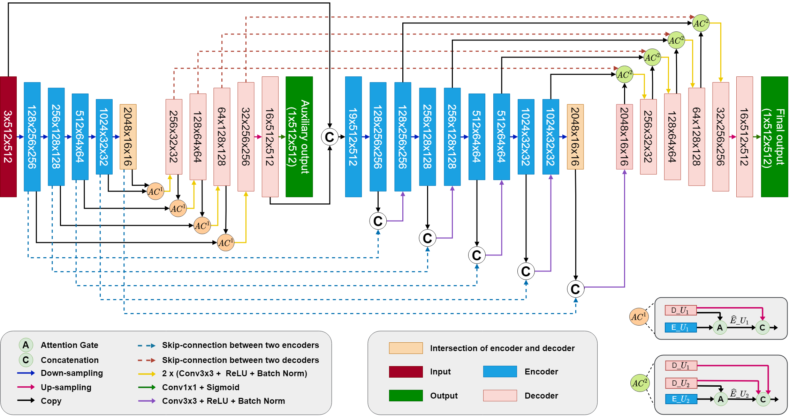
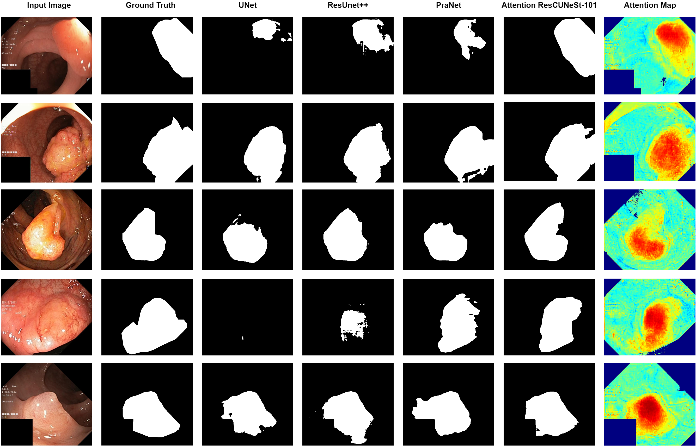

# AG-CUResNeSt: A Novel Method for Colon Polyp Segmentation
>Abstract
Colorectal cancer is among the most common malignancies and can develop from high-risk colon polyps. Colonoscopy is an effective screening tool to detect and remove polyps, especially in the case of precancerous lesions. However, the missing rate in clinical practice is relatively high due to many factors. The procedure could benefit greatly from automatic polyp segmentation models, which provide valuable insights for colon polyp detection improvement. How- ever, precise segmentation is still challenging due to the variation of polyps in size, shape, texture, and color. This paper proposes a novel neural network architecture called AG-CUResNeSt, which enhances Coupled UNets using the robust ResNeSt backbone and attention gates. The network is capable of ef- fectively combining multi-level features to yield accurate polyp segmentation. Experimental results on five popular benchmark datasets show that our pro- posed method achieves state-of-the-art accuracy compared to existing methods.


------
<figure>
  
  <figcaption>Figure 1. Overview of the proposed AG-CUResNeSt. Attention gates within each UNet are used to suppress irrelevant information in the encoder’s feature maps. Skip connections across the two UNets are also utilized to boost the information flow and promote feature reuse.</figcaption>
</figure>

------

### 1. Download the pretrained model 
Download here [Google Driver](https://drive.google.com/drive/folders/1hcA8dQEKleNrVT5PYiEF2z4U878ZTy1O?usp=sharing)
Put it into `./checkpoints`

### 2. Download the testing dataset
Download here [Google Driver](https://drive.google.com/drive/folders/1yRVLUiKrv8aKvp2649f0Ir_GPTZBbDBs?usp=sharing)
Put it into `.datasets`

### 3. Configure the experiment
In `configs.py`, choose any block and uncomment it

### 4. Run the experiment
Run the following command
```sh
run.sh
```
Just enjoy it!

------
<figure>
  
  <figcaption>Figure 6: Qualitative result comparison of different models trained in the Scenario 6, i.e. 5-fold cross-validation on the Kvasir-SEG dataset.</figcaption>
</figure>

Other comparison results [Google Driver](https://drive.google.com/drive/folders/1PRdrjRvxb6vgKNqf07x29OnkywyWha6N?usp=sharing)

<br />

------
**Author** <br />
Chung Tran Quang: Hanoi University of Science and Technology <br />
Sang Dinh Viet: Hanoi University of Science and Technology <br />
**Contact** <br />
If you have any question, please contact me via email: *bktranquangchung@gmail*
